IREX
====

The IREX process follows an iterative process, where a set of candidate input variables are identified and proposed for its revision by the expert user. Finally, once anomalous variables are confirmed, they are used to modify the prediction model.

IREX Architecture
-----------------

The IREX software was developed in Python 3, where XAI methods can be used by importing all the needed libraries. IREX is available in a Python script file that can be run in Spyder (recommended), Pycharm, or Jupyter notebooks.

1. Model creation, training, and evaluation using the Scikit-learn library and the Pandas and Numpy packages.
2. Anomalous item identification using the ALE algorithm provided by the Alibi framework
3. Anomalous item explanation, through a novel visualization method based using heatmaps (Pyplot lib) and the LIME, SHAP, and Permutation Feature Importance XAI methods.
4. Feedback collection and dataset+model refinement.

Funtionalities
--------------

The iterative process that the IREX software follows to refine a classification model can be resumed in five steps:

1. The model is created, trained and evaluated. By default, Artificial Neural Network (ANN) models are employed as they usually achieve a higher performance than other ML methods. Evaluation is presented using standard performance metrics such as precision/recall tables and the confusion matrix.

2. The ANN model is introspected with the Accumulated Local Effect (ALE) method to analyze the influence and impact of each item in the classification. In this step, IREX identifies those variables that may lead to a lower performance according to the behaviour expected by the expert user. From this analysis, input variables can be categorized as follows:

    - **Irrelevant**, when the impact of the item in the classification according to ALE is not significant and has a low influence on the final result.
    - **Inconsistent**, when the item has a behaviour opposite to what had been expected (e. g. when certain values are supposed to raise the score for a given class, but instead, the item reduces this possibility.). We refer to these variables as "potentially anomalous items" (PAIs).
    
3. IREX provides a visualization of these findings through different heatmaps that explain the impact of each input variable using a color scale. This way, irrelevant items have a color close to white, whereas a darker color implies a higher impact on the classification. Variables following the expected behavior are represented in blue, while PAIs are presented in red. These heatmaps can (a) summarize the average impact of input variables for a given class, (b) compare the impact estimated by different XAI methods, and (c) provide an individualized analysis for each instance in the dataset.

4. The expert user will confirm or discard the abnormal behavior of these variables through the analysis of these heatmaps, particularly those PAIs represented in red color-scale.

5. The feedback provided by the expert user consisting of a list of confirmed anomalous items is used to remove the corresponding variables from the input dataset. With this, the ANN model can be retrained with the new data to start over with the first step.

This process is repeated until the software finds no other PAIs in the dataset, generating a final chart describing the trade-off between removed PAIs and the model performance.

Example
=======

First, create an IREX object named IREX, like this:

.. code-block:: console

   IREX = IREX()

With this, you can easily see how IREX's functions works.

Then, we highly recommend to use IREX with the following sequence of functions:

.. code-block:: console

   IREX.load_IREX_datasets()

.. code-block:: console

   IREX.reset() ##For first iteration or
   IREX.iterate() ##For second or greater iteration

.. code-block:: console

   IREX.train_model(do_oversample = True, optimize = False, saveModel = True)

.. code-block:: console

   IREX.evaluate_model()

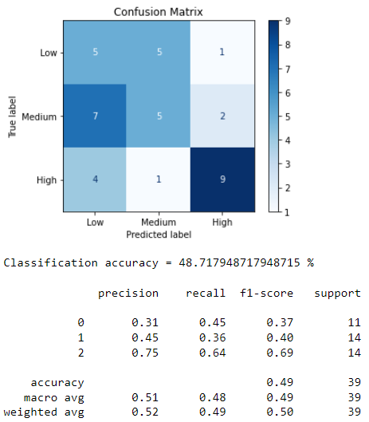

.. code-block:: console

   IREX.run_ALE()

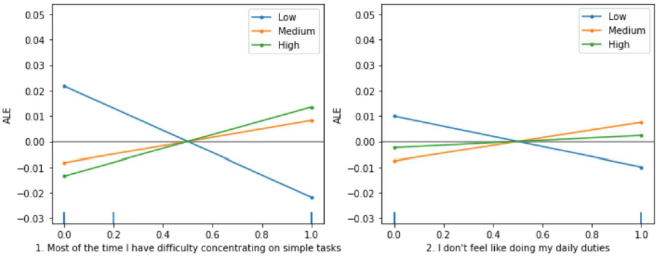

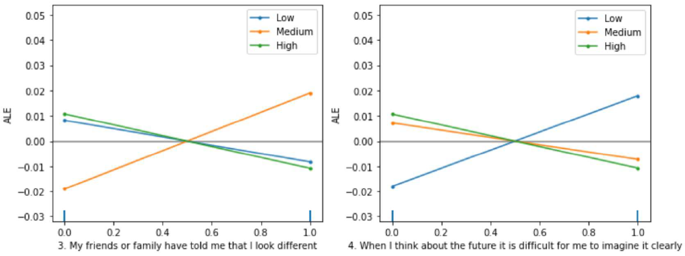

.. code-block:: console

   IREX.apply_Threshold(0.01, -0.01)

.. code-block:: console

   IREX.search_PAI("POSITIVE_CLASS")

.. code-block:: console

   IREX.run_LIME()

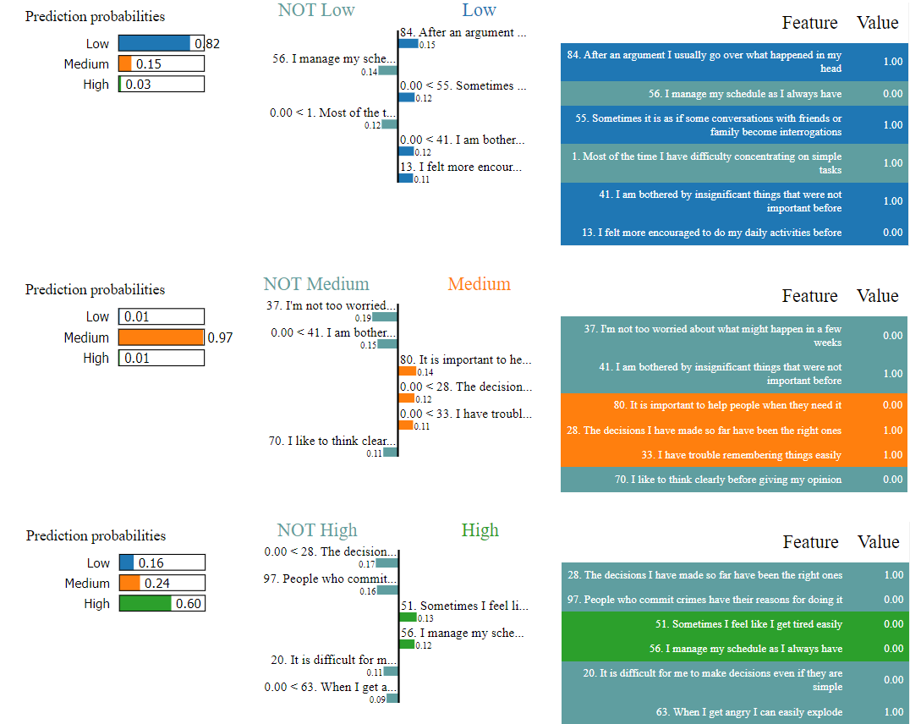

.. code-block:: console

   IREX.run_SHAP()

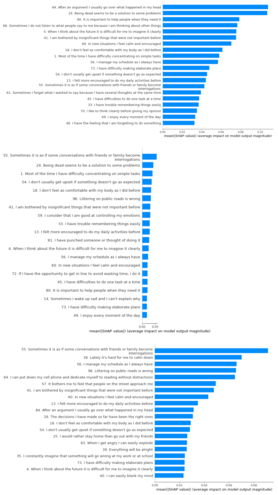

.. code-block:: console

   IREX.precompute_Heatmaps()

.. code-block:: console

   IREX.run_Feature_Importance_Heatmap()

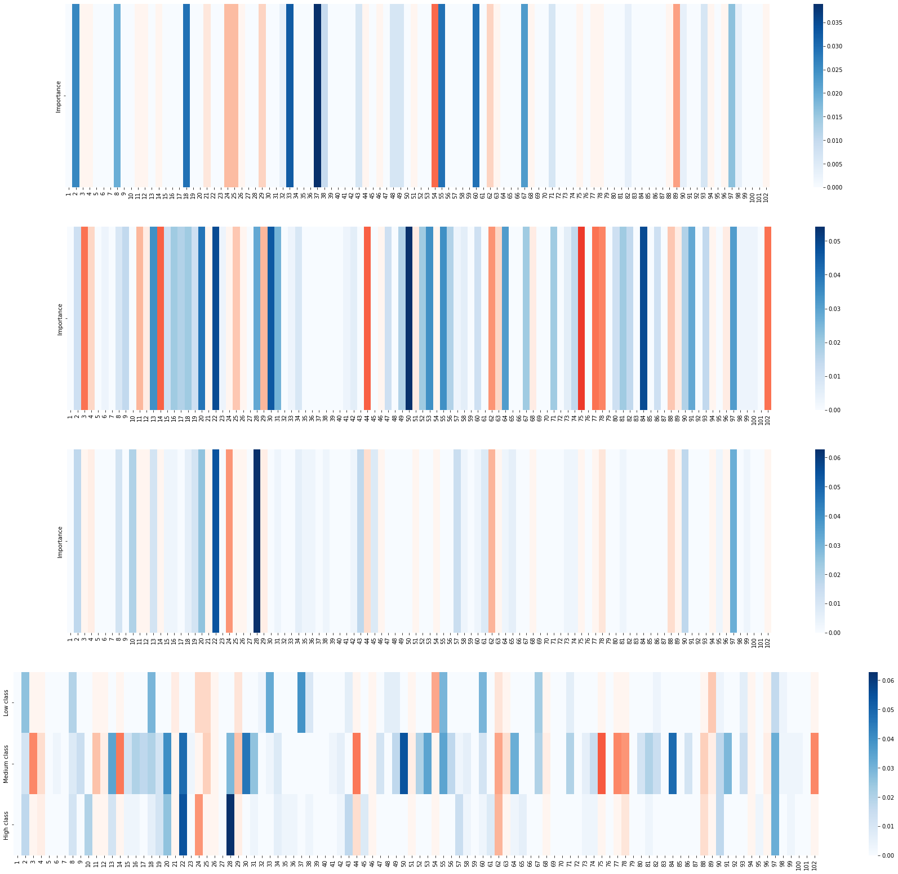

.. code-block:: console

   IREX.run_SHAP_Heatmap()

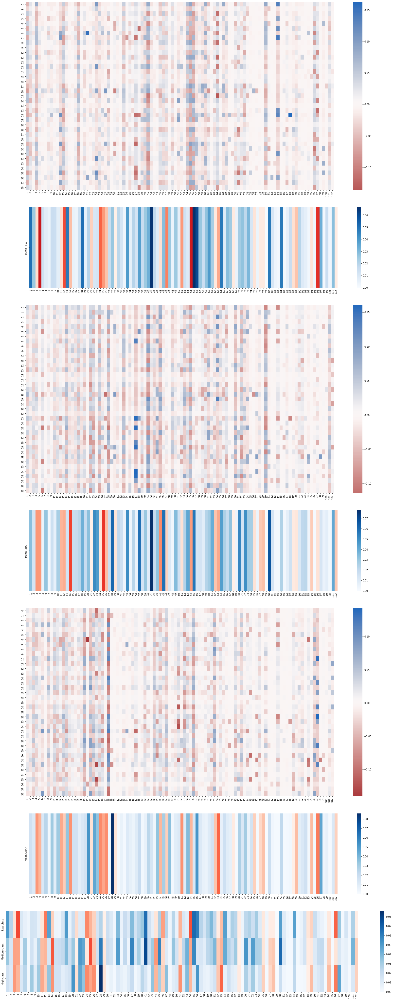

.. code-block:: console

   IREX.run_LIME_Heatmap()

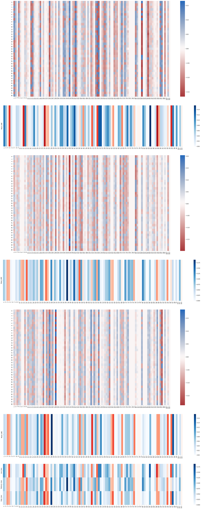

.. code-block:: console

   IREX.run_ALE_Heatmap()

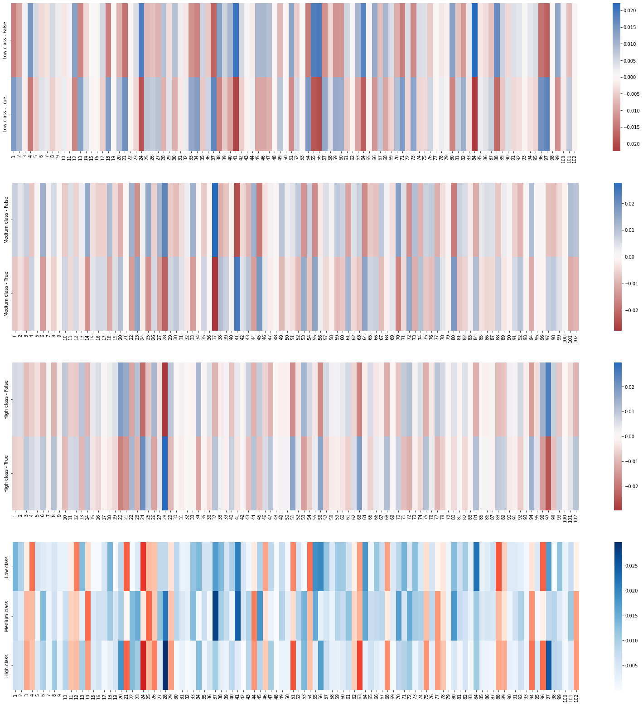

.. code-block:: console

   IREX.run_Compare_Heatmaps()

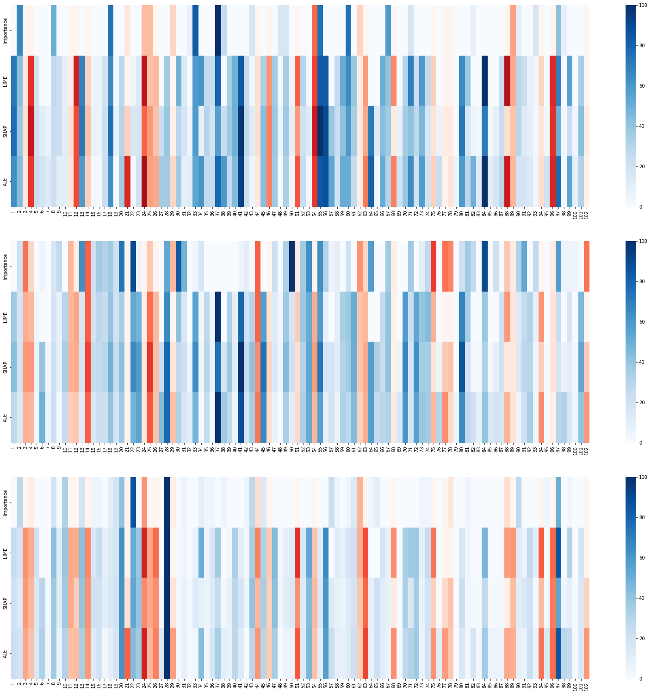

.. code-block:: console

   IREX.plot_global_process(['gray', 'black', 'red'])

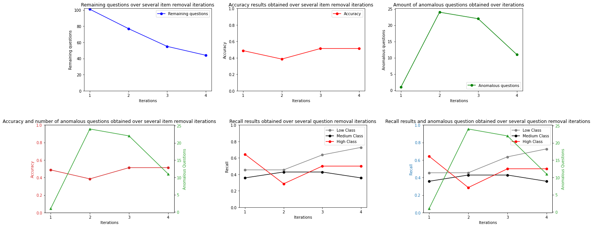
